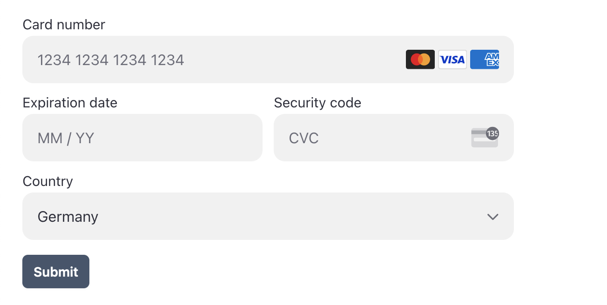

# Vue Stripe.js

[](https://github.com/ectoflow/vue-stripe-js/actions)
[](https://www.npmjs.com/package/vue-stripe-js)
[](https://bundlephobia.com/result?p=vue-stripe-js)
[](https://www.npmjs.com/package/vue-stripe-js)
[](https://vshymanskyy.github.io/StandWithUkraine)

Vue 3 components for Stripe. Build advanced payment integrations quickly. Easy to start, friendly DX, minimal abstractions, and full control. It's a glue between Stripe.js and Vue component lifecycle.

### [**Become a sponsor** 💜](https://github.com/sponsors/softbeehive)
Consider supporting efforts to make this project healthy and sustainable. Thank you!

## Quickstart ⚡️

### Upgrade
• [**Upgrade guide**](docs/UPGRADE_V1_TO_V2.md)   
• **[Docs v1](https://github.com/ectoflow/vue-stripe-js/tree/v1.0.4)**

### 1. Install

```bash
npm i vue-stripe-js @stripe/stripe-js
```

### 2. Load Stripe.js

```vue
<script setup lang="ts">
import { onBeforeMount, ref } from "vue"
import { loadStripe } from "@stripe/stripe-js"
import type { Stripe } from "@stripe/stripe-js"

const publishableKey = ref('')
const stripe = ref<Stripe | null>(null)

onBeforeMount(async() => {
  stripe.value = await loadStripe(publishableKey.value)
})
</script>
```

Alternatively, include a script tag. Make sure Stripe.js is loaded before you mount Vue components.

```html
<script src="https://js.stripe.com/v3/"></script>
```

### 3. Payment Element

Based on – [deferred payment guide](https://docs.stripe.com/payments/accept-a-payment-deferred?type=payment)

```vue
<template>
  <form
    v-if="stripeLoaded"
    @submit.prevent="handleSubmit"
  >
    <StripeElements
      :stripe-key="stripeKey"
      :instance-options="stripeOptions"
      :elements-options="elementsOptions"
      ref="elementsComponent"
    >
      <StripeElement
        type="payment"
        :options="paymentElementOptions"
        ref="paymentComponent"
      />
    </StripeElements>
    <button
      type="submit"
    >
      Submit
    </button>
  </form>
</template>

<script setup lang="ts">
import { onBeforeMount, ref } from "vue"
import { loadStripe } from "@stripe/stripe-js"
import { StripeElements, StripeElement } from "vue-stripe-js"

import type {
  StripeElementsOptionsMode,
  StripePaymentElementOptions,
} from "@stripe/stripe-js"

const stripeKey = ref("pk_test_f3duw0VsAEM2TJFMtWQ90QAT")
const stripeOptions = ref({
  // https://stripe.com/docs/js/initializing#init_stripe_js-options
})
const elementsOptions = ref<StripeElementsOptionsMode>({
  // https://stripe.com/docs/js/elements_object/create#stripe_elements-options
  mode: "payment",
  amount: 1099,
  currency: "usd",
  appearance: {
    theme: "flat",
  },
})
const paymentElementOptions = ref<StripePaymentElementOptions>({
  // https://docs.stripe.com/js/elements_object/create_payment_element#payment_element_create-options
})
const stripeLoaded = ref(false)
const clientSecret = ref("")

// Define component refs
const elementsComponent = ref()
const paymentComponent = ref()

onBeforeMount(() => {
  loadStripe(stripeKey.value).then(() => {
    stripeLoaded.value = true

    // Good place to call your backend to create PaymentIntent
    // Skipping to the point when you got client_secret

    // clientSecret.value = client_secret
  })
})

async function handleSubmit() {
  // Confirm the PaymentIntent using the details collected by the Payment Element
  const stripeInstance = elementsComponent.value?.instance
  const elements = elementsComponent.value?.elements

  if (stripeInstance) {
    const { error } = await stripeInstance.confirmPayment({
      elements,
      clientSecret: clientSecret.value,
      confirmParams: {
        return_url: "https://example.com/order/123/complete",
      },
    })

    if (error) {
      // This point is only reached if there's an immediate error when
      // confirming the payment. Show the error to your customer (for example, payment details incomplete)
      console.log(error)
    } else {
      // Your customer is redirected to your `return_url`. For some payment
      // methods like iDEAL, your customer is redirected to an intermediate
      // site first to authorize the payment, then redirected to the `return_url`.
    }
  }
}
</script>

```

## Examples 🌿

Thanks to the Provider Pattern used in StripeElements, you get minimalist tools with full access to Stripe.js methods and properties. This results in better developer experience (DX), simpler code, and fewer bugs.

These examples use Vue Composition API and TypeScript.

- [All](examples/)
- [Payment](examples/PaymentElementDeferred.vue)
- [Card](examples/CardElement.vue)
- [Express Checkout](examples/ExpressCheckoutElement.vue)

### Screenshot



## Advanced integration 🏗️

All features of Stripe.js are available in two components. The benefits of Vue solution: element is created and destroyed automatically, options are reactive, event listeners are attached to StripeElement. Simple and future-proof.

🥇 **Most important property is type** 🥇

```html
<StripeElements>
  <StripeElement type="payment" />
</StripeElements>
```

Available types
```ts
type StripeElementType =
  | 'address'
  | 'affirmMessage'
  | 'afterpayClearpayMessage'
  | 'auBankAccount'
  | 'card'
  | 'cardNumber'
  | 'cardExpiry'
  | 'cardCvc'
  | 'currencySelector'
  | 'epsBank'
  | 'expressCheckout'
  | 'fpxBank'
  | 'iban'
  | 'idealBank'
  | 'p24Bank'
  | 'payment'
  | 'paymentMethodMessaging'
  | 'paymentRequestButton'
  | 'linkAuthentication'
  | 'shippingAddress'
  | 'issuingCardNumberDisplay'
  | 'issuingCardCvcDisplay'
  | 'issuingCardExpiryDisplay'
  | 'issuingCardPinDisplay'
  | 'issuingCardCopyButton'

// Check actual element types in @stripe/stripe-js
```

## Events

```html
<StripeElement @blur="doSomething" />
```
Following events are emitted on StripeElement

- change
- ready
- focus
- blur
- click
- escape
- loaderror
- loaderstart


## Styling

Add classes to components

```html
<StripeElements class="border">
  <StripeElement class="p-4" type="card" :options="cardOptions" />
</StripeElements>
```

Style element via options - [read documentation](https://stripe.com/docs/js/appendix/style)

```ts
const cardOptions = ref<StripeCardElementOptions>({
  style: {
    base: {
      iconColor: "green",
    },
    invalid: {
      iconColor: "red",
    },
  },
})
```
